  

  <h3>사용자에게 도움이 되는 소프트웨어를 만드는 개발자 Craft374입니다.</h3>
  
Python과 C#을 중심으로 개발하며, 데이터사이언스와 AI를 공부하고 있습니다.

## About Me

사용자가 실제로 편하게 사용할 수 있는 프로그램을 만드는 데 관심이 있습니다.  
새로운 기술을 직접 프로젝트에 적용하며 꾸준히 배우고 있습니다.

## Education

- 연세대학교 미래캠퍼스 데이터사이언스학부 재학 (2025–현재)

## Awards & Honors

- **최우수상** — 2025년 연세대학교 미래캠퍼스 AI 사피엔스 경진대회
- **우수상** — 2019년 제2회 메이커 히어로즈 대회, System Halted 팀

## Tech Stack

### Languages

  
  
  
  

### Hardware

  
  

## Contact

  
  
  

## GitHub Activity

  
  

